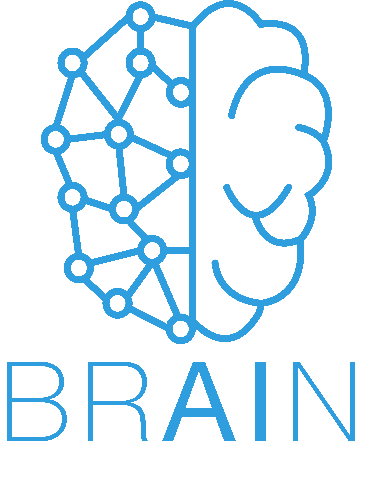

# BRAIN NTNU: Workshop AI with Cognite

<p align="center">
  

</p>

## Setup

### Install Poetry

In this project we are using [Poetry](https://python-poetry.org/) for python dependency management. This will
automagically create a virtual environment and install the correct dependencies. To get started you first have to
install poetry following.

For osx / linux / bashonwindows:

```
curl -sSL https://raw.githubusercontent.com/python-poetry/poetry/master/get-poetry.py | python -
```

For windows powershell:

```
(Invoke-WebRequest -Uri https://raw.githubusercontent.com/python-poetry/poetry/master/get-poetry.py -UseBasicParsing).Content | python -
```

To verify that you have installed Poetry correctly run

```
poetry --version
```

### Install workshop dependencies

Then to get started with the workshop move into `brain-ntnu-workshop-ai-2022` and run

```
poetry install
```

in the same folder as the `pyproject.toml` file is. In this file you will find and overview of all third-party libraries
that we will use, and some general information about the project. The
`poetry.lock` file contains the exact information about the dependencies, so that everything is reproducible and makes
sure that every installation looks exactly the same.

To test that you have installed everything correct you can run

```
poetry run check-setup
```

This is a custom script which sets up the environment and runs the coded specified in the
`pyproject.toml` file under `[tool.poetry.scripts]`. There will be similar scripts for all tasks during this workshop.

## Task 1 - Getting Started

### Connect to WiFi

The drone you will be working with during this workshop is a DJI Tello. To communicate with the drone you would have to
join the WiFi setup by the drone itself. It should look like this: `TELLO-12345`, where 12345 is the ID of your drone.
Each drone has its own ID, so make sure that you are connecting to the one you are handed out.

### Fly drone, fly 🚁

In order to give commands to the drone we will use the commands available in `djitellopy`. Review the code in
`workshop/gettings_started.py` and by set up a simple command line to execute different actions.

Check out the [DJITelloPy API Reference](https://djitellopy.readthedocs.io/en/latest/tello/) and see all the available
commands. A good place to start would be the
[takeoff()](https://djitellopy.readthedocs.io/en/latest/tello/#djitellopy.tello.Tello.takeoff) command.

Run the code with

```
poetry run getting-started
```

## Task 2 - Control and livestream

### Drone - The Movie 🎥

Now the commands you can run in Task 1 is cool, but you always have to see the drone with your own eyes in order to know
where it is. In this task you use the controller we have set up to you and review the world from the drone's
perspective.

To review the code check out `workshop/controller.py`. This uses `pygame` to track what buttons are pressed on the
keyboard and what frame to show in the UI. The commands sent to the drone is similar to what you did in previous task,
but we have to do some tricks in order for it to respond smoothly.

The controls are:

- T: Takeoff
- L: Land
- Arrow keys: Forward, backward, left and right.
- A and D: Counter clockwise and clockwise rotations (yaw)
- W and S: Up and down.

Now just get to know the drone, and then we can move over to some neural networks.

Run the code with

```
poetry run controller
```

## Task 3 - Object Detection

### TLDR; Pre-trained Convolutional Neural Network (CNN) on the COCO dataset.

We would like to do _object detection_, meaning that we would like to draw boxes around the objects in the camera frame
that the neural network recognizes. There are multiple ways to do this, but in this workshop we will use a _pre-trained_
model called **SSDLite** from the `torchvision` model library. SSDLite is a _Convolutional Neural Network (CNN)_
and is pre-trained on [COCO](https://cocodataset.org/#home) train2017 (COCO = Common Objects in Context), which consists
of 91 different classes like person, bicycle, car etc... The model take as input an image and outputs the predicted
bounding boxes and its corresponding probability and label. For example a `bounding_box=(10, 10, 20, 20)`
, `label=person` person, and  `score=0.9` tells us at that the bounding box covering the coordinates (10,10) and (20,20)
has with a 90% probability a person inside the market area.

### A 🐻 or a 🚗?

Now that we have a great way to view data visual data from the drone, let us try to use som neural networks to predict
what the drone is actually seeing. As explained above we will use the SSDLite model for this. The reason for this is
that SSDLite is really fast, and we can make predictions on every frame shown by the drone while running on your own
computer.

In this task you need to both write some code in `controller.py` and in `object_detection.py`. These are the things you
need to do:

1. Initialize `self.model` in `controller.py`. _Psst! Look for a method in `object_detection.py`._
2. Finish the method in `object_detction.py` called `predict(model, x)`
3. Make predictions on the reshaped frame in the `predict_frame()` method in `controller.py`
4. Call the `predict_frame()` method in `run()` in `controller.py` by removing the comments

If everything is good now, you should see the model making predictions on the camera stream from the drone.

Run the code with

```
poetry run controller
```

## Task 4 - Save images to file

### Inspection points 🕵🏼‍️

In Cognite have robots walking out in industrial areas. In most cases we only want to make predictions at certain
inspection points, and not at every frame. We also usually do not want to make predictions on the robot itself, as this
restricts us to smaller and faster neural networks like the SSDLite model. In order to run big models, we push that work
to the cloud. As a first step towards predictions in the cloud, you first need to store the images. In this task you
will add functionality to save the current camera frame to the `data` folder when pressing the `SPACE` button. You will
find a fitting area for that in the `controller.py` file.

Could also be a good idea to turn of the predictions on each frame from last task in order to store the frame without
the bounding boxes.

Run the code with

```
poetry run controller
```

## Task 5 - Bigger models?

Use everything you have learned so far to make predictions on the images saved in the `data` folder.

Feel free to try out other pre-trained neural networks than SSDLite as used in previous task. What about Faster R-CNN
for example?

Run the code with

```
poetry run object-detection
```

## Task 6 - Cognite Data Fusion™ ☁️

You should be happy with what you have achieved so far. In this task I just want to show you how to upload the images
from the drone to the cloud.

Cognite Data Fusion™, the leading Industrial DataOps platform, contextualizes operational asset data at scale in
real-time, enabling companies to make better decisions about maintenance, production, and safety. This is Cognite's main
product, and if you are interested, you can read more about it
[here](https://www.cognite.com/en/product/cognite_data_fusion_industrial_dataops_platform).

Review the code in `cdf_uploader.py` and upload the images to a dataset in Cognite Data Fusion where it can be further
contextualized.

For this task you would need some secret variables in order to access the dataplatform. Ask the instructors for a `.env`
file.

Run the code with

```
poetry run object
```


## What now? 🏆
Well now, if you get this far, first of all, great job! Play around with the functionality of the drone,
and rumours have it that the drone can actually do flips in the air 👀 Arrange a race with your neigbours, and
learn from each other. Think about the use cases for drones like this.
